# 
Douglas Henrique Machado de Lima

  
### 🚀 CEO & CTO na AsimovTech Systems | Engenheiro de Dados | Cientista de Dados | Desenvolvedor Full Stack

*Transformando ideias em soluções tecnológicas inovadoras*

---

## 🎯 Sobre Mim

Sou um empreendedor e desenvolvedor apaixonado por tecnologia, com formação em **Sistemas de Informação** e **Física**. Como CEO e CTO da **AsimovTech Systems**, lidero uma equipe dedicada a criar soluções inovadoras que impactam positivamente a vida das pessoas.

- 🔬 **70+ projetos** desenvolvidos em diversas áreas tecnológicas
- 🏢 **15+ projetos** em produção ativa
- 🌱 **20+ projetos** em desenvolvimento contínuo
- 🎯 **Especialidades:** IA, Blockchain, Trading Algorítmico, SaaS, DevOps

---

## 🏢 Empresa Principal

<table>
  <tr>
    <td align="center" width="50%">
      
      <h3>AsimovTech Systems</h3>
      
<a href="https://asimovtech.systems/">🌐 asimovtech.systems</a>

      
Empresa de tecnologia especializada em soluções inovadoras

    </td>
    <td align="center" width="50%">
      
      <h3>AsimovTech Ventures</h3>
      
<a href="https://asimovtech-ventures.vercel.app/">🌐 Fundo de Investimento</a>

      
Investimentos focados em startups de tecnologia

    </td>
  </tr>
</table>

---

## 🤝 Startups Parceiras

<table>
  <tr>
    <td align="center" width="25%">
      <h4>NarenInk</h4>
      
Consultoria Tecnológica (Comercial)

    </td>
    <td align="center" width="25%">
      <h4>Muttercorp</h4>
      
Consultoria Tecnológica (Programação)

    </td>
    <td align="center" width="25%">
      <h4>KVM Personal Trainer</h4>
      
Sistemas de Fitness

    </td>
    <td align="center" width="25%">
      <h4>ReisBit & PlumbEdit</h4>
      
Edição de Vídeos

    </td>
  </tr>
</table>

---

## 🚀 Projetos em Produção

<table>
  <tr>
    <td align="center" width="33%">
      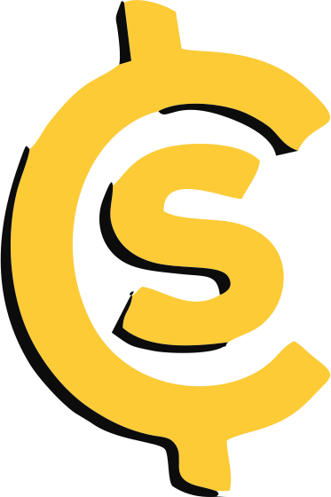
      <h3>CryptoSignals</h3>
      
<a href="https://cryptosignals.me/">🌐 cryptosignals.me</a>

      
Plataforma SaaS de elite para trading de criptomoedas

      
<em>Trading & Criptomoedas</em>

    </td>
    <td align="center" width="33%">
      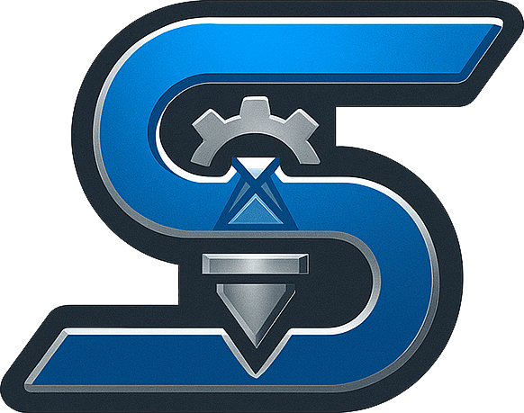
      <h3>StarkWorks Maker 3D</h3>
      
<a href="https://starkworks-maker-3-d.vercel.app/">🌐 Plataforma</a>

      
Startup de impressão 3D sob demanda

      
<em>Impressão 3D</em>

    </td>
    <td align="center" width="33%">
      
      <h3>RemoteOPS</h3>
      
🔧 Produto Pronto

      
Plataforma SaaS para gerenciamento de máquinas virtuais

      
<em>DevOps & Infraestrutura</em>

    </td>
  </tr>
  <tr>
    <td align="center">
      
      <h3>PersonalTrainer App</h3>
      
🏋️ Suporte Tecnológico

      
Sistema completo para personal trainers

      
<em>Fitness & Saúde</em>

    </td>
    <td align="center">
      
      <h3>WhatsApp PDF Bot</h3>
      
🤖 Produção

      
Bot para compressão de PDFs via WhatsApp

      
<em>Automação</em>

    </td>
    <td align="center">
      
      <h3>DriveTube</h3>
      
📺 Produto Pronto

      
Interface para vídeos do Google Drive

      
<em>Streaming & Educação</em>

    </td>
  </tr>
</table>

---

## 🛠️ Projetos em Desenvolvimento Ativo

<table>
  <tr>
    <td align="center" width="33%">
      
      <h3>NEXLIFY</h3>
      
🛡️ Projeto Principal

      
Plataforma de análise de riscos cibernéticos

      
<strong>Valor:</strong> ~12.000€ por análise

      
<em>Cibersegurança</em>

    </td>
    <td align="center" width="33%">
      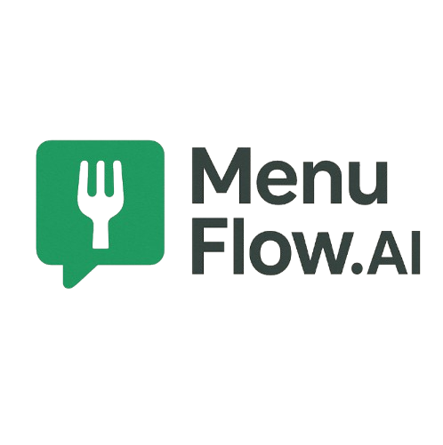
      <h3>MenuFlowAI</h3>
      
<a href="https://landingpage-menuflowai.vercel.app/">🌐 Landing Page</a>

      
Cardápio digital com integração WhatsApp

      
<em>Restaurantes & Food Tech</em>

    </td>
    <td align="center" width="33%">
      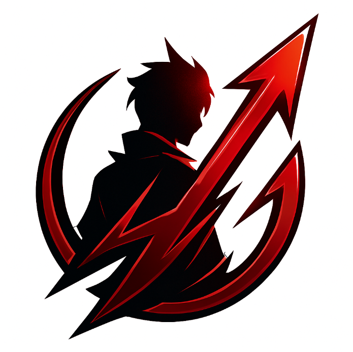
      <h3>Flash Compliance</h3>
      
<a href="https://flash-compliance-landingpage.vercel.app/">🌐 Landing Page</a>

      
SaaS para verificação de trocas atômicas

      
<em>Compliance & Blockchain</em>

    </td>
  </tr>
  <tr>
    <td align="center">
      
      <h3>DocGenie</h3>
      
<a href="https://landingpage-docgenie.vercel.app/">🌐 Landing Page</a>

      
SaaS para análise de documentos jurídicos

      
<em>Jurídico & Contábil</em>

    </td>
    <td align="center">
      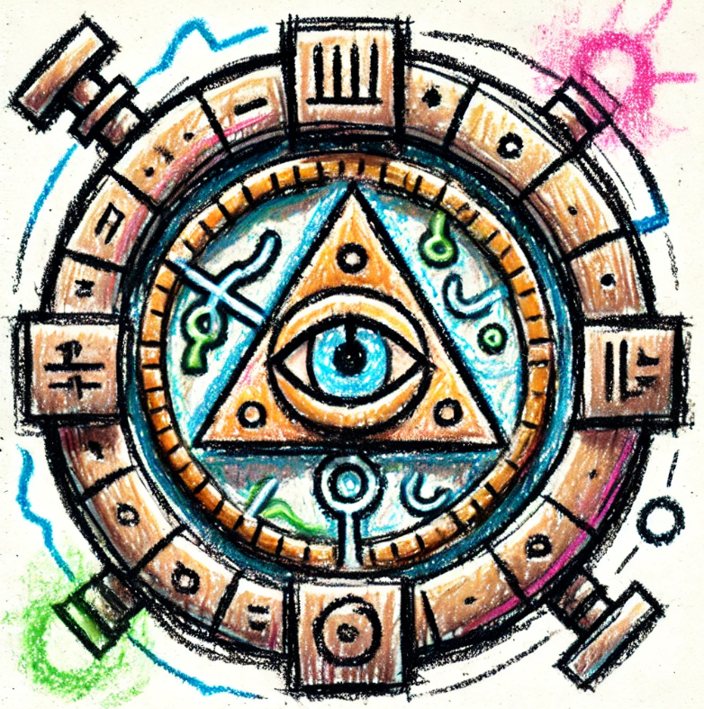
      <h3>TempoBrincar</h3>
      
🎮 Desenvolvimento

      
App educativo para crianças

      
<em>Educação Infantil</em>

    </td>
    <td align="center">
      
      <h3>EchoPilot</h3>
      
🎥 Plataforma

      
Mensagens em vídeo com IA

      
<em>Comunicação & IA</em>

    </td>
  </tr>
</table>

---

## 🔬 Projetos de Pesquisa & Inovação

<table>
  <tr>
    <td align="center" width="25%">
      
      <h3>QuantAsimov</h3>
      
⚛️ Blockchain Quantum-Resistant

      
<em>Blockchain & Quantum</em>

    </td>
    <td align="center" width="25%">
      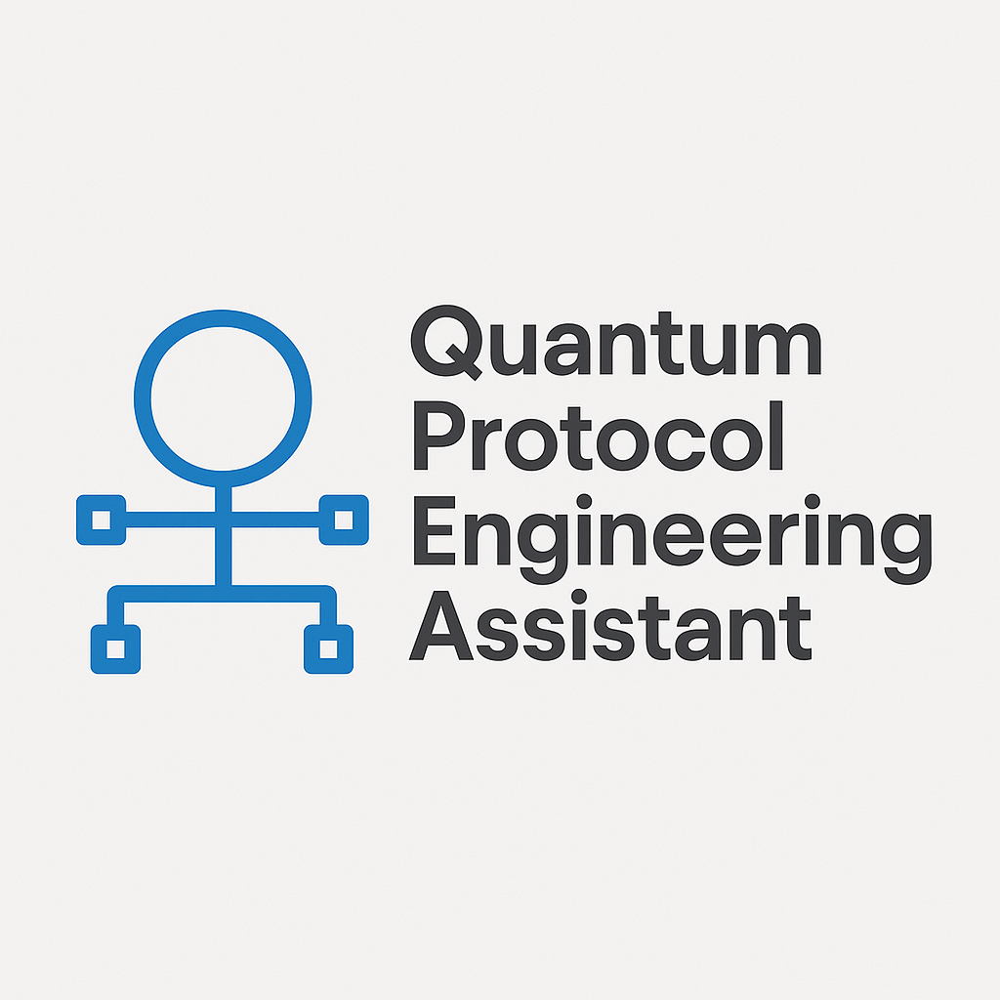
      <h3>QPEA-Quantum</h3>
      
🔬 Quantum Protocol Assistant

      
<em>Computação Quântica</em>

    </td>
    <td align="center" width="25%">
      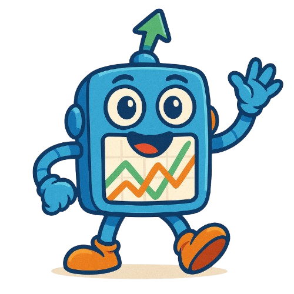
      <h3>Foresight</h3>
      
📊 Framework de Previsão

      
<em>Monitoramento & IA</em>

    </td>
    <td align="center" width="25%">
      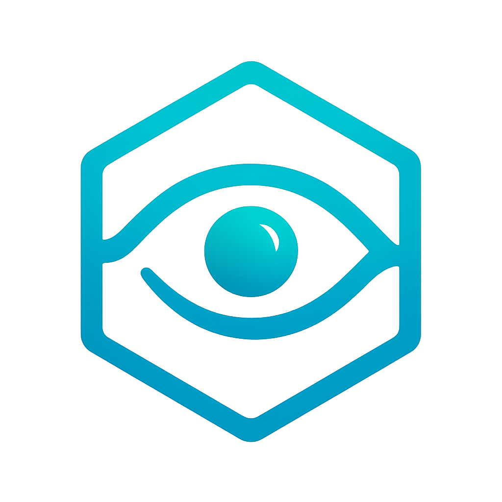
      <h3>Foresight Cloud</h3>
      
☁️ SaaS de Monitoramento

      
<em>Cloud & Previsão</em>

    </td>
  </tr>
</table>

---

## 📊 Trading & Finanças

<table>
  <tr>
    <td align="center" width="25%">
      
      <h3>JarvisTrade</h3>
      
🤖 Bot de Trading Local

      
<em>Trading Automatizado</em>

    </td>
    <td align="center" width="25%">
      
      <h3>ALMA Trading</h3>
      
📈 Sistema Algorítmico

      
<em>ML & Backtesting</em>

    </td>
    <td align="center" width="25%">
      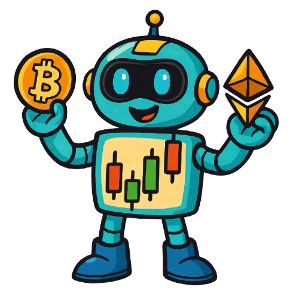
      <h3>Foretrading</h3>
      
📊 Framework de Mercado

      
<em>Séries Temporais</em>

    </td>
    <td align="center" width="25%">
      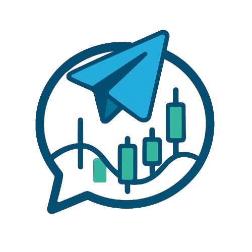
      <h3>CryptoSignals Bot</h3>
      
📱 Sistema Telegram

      
<em>Sinais de Trading</em>

    </td>
  </tr>
</table>

---

## 🎮 Gaming & Entretenimento

<table>
  <tr>
    <td align="center" width="33%">
      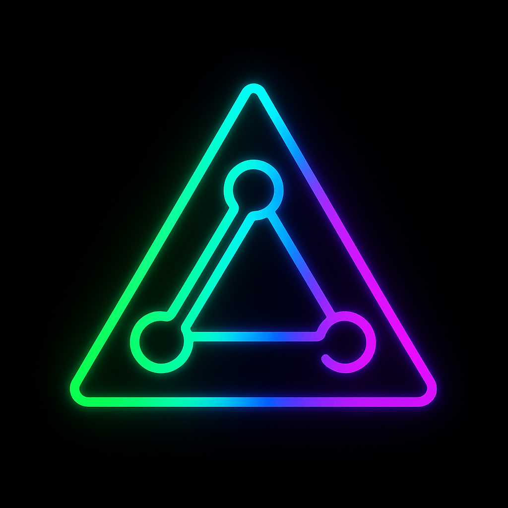
      <h3>ASIMOV Network</h3>
      
🌐 asimov.network

      
Plataforma cyberpunk com roleplay

      
<em>Gaming & Comunidade</em>

    </td>
    <td align="center" width="33%">
      <h3>Jyhhad</h3>
      
🎯 Suporte MutterCorp

      
Plataforma de jogos com tokenomics

      
<em>Gaming & Blockchain</em>

    </td>
    <td align="center" width="33%">
      
      <h3>StreamView</h3>
      
🏗️ Timelapses com IA

      
Geração automática para construção

      
<em>Construção Civil</em>

    </td>
  </tr>
</table>

---

## 🤖 Inteligência Artificial & Automação

<table>
  <tr>
    <td align="center" width="25%">
      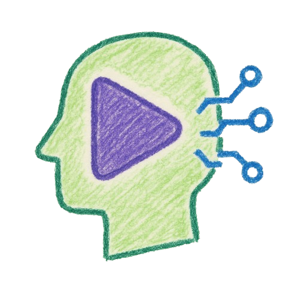
      <h3>VideoMind AI</h3>
      
🎬 Automação YouTube Shorts

      
<em>Criação de Conteúdo</em>

    </td>
    <td align="center" width="25%">
      
      <h3>Nexlify Agents</h3>
      
🧠 Framework de Agentes IA

      
<em>Inteligência de Enxame</em>

    </td>
    <td align="center" width="25%">
      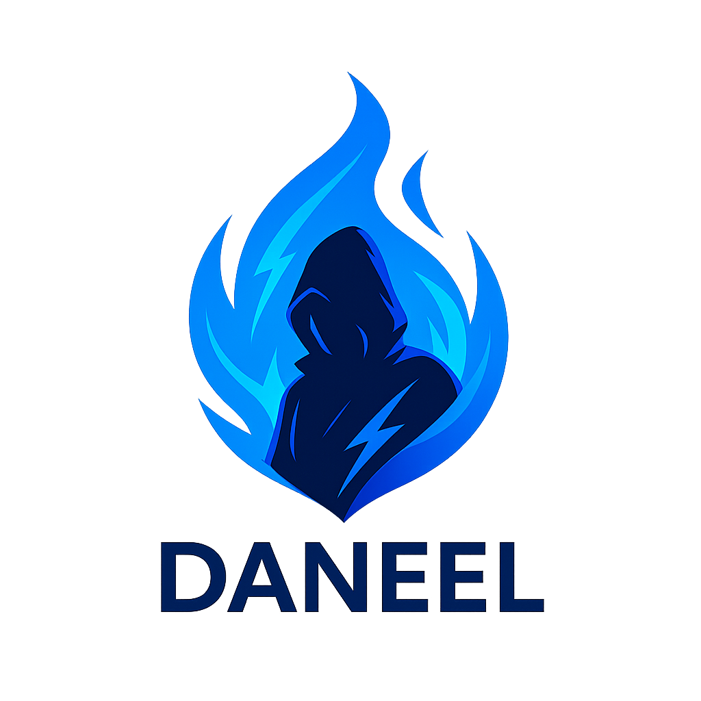
      <h3>Daneel</h3>
      
💬 Motor de Conversação

      
<em>Agentes Inteligentes</em>

    </td>
    <td align="center" width="25%">
      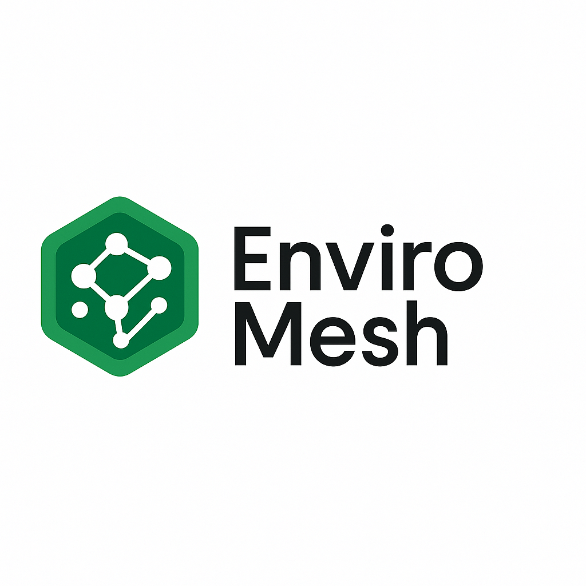
      <h3>EnviroMesh</h3>
      
🌿 Fusão de Dados IoT

      
<em>Dados Ambientais</em>

    </td>
  </tr>
</table>

---

## 🏥 Saúde & Fitness

<table>
  <tr>
    <td align="center" width="33%">
      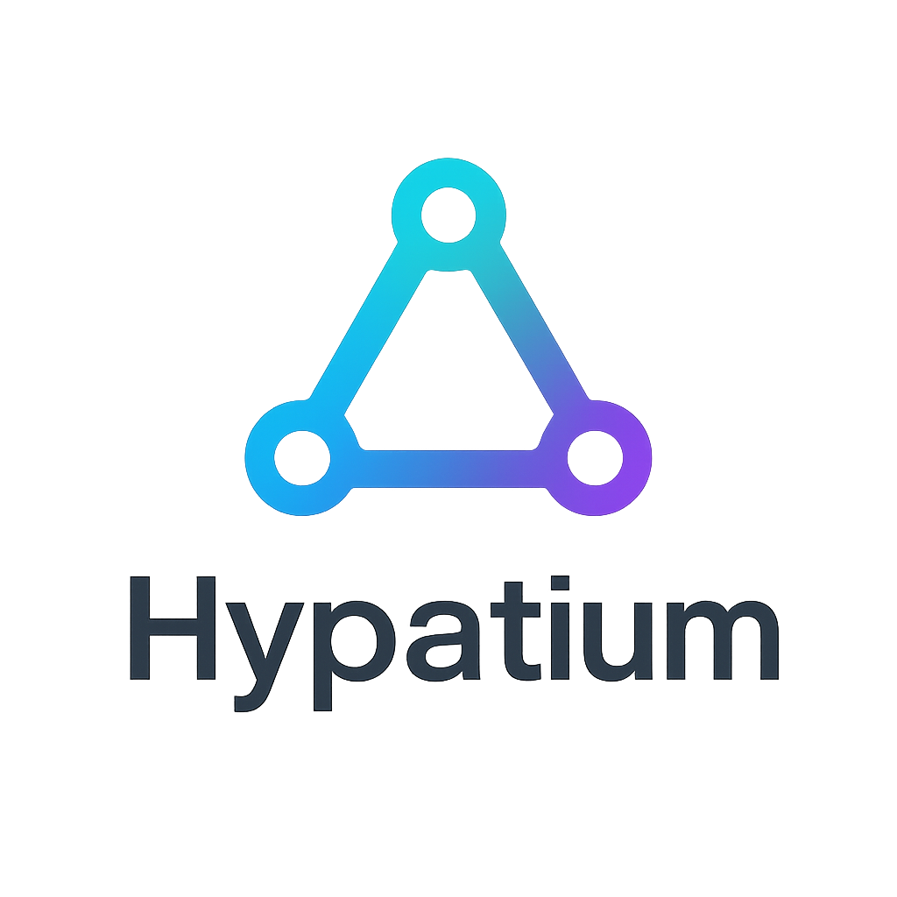
      <h3>Hypatium</h3>
      
🏥 Plataforma Integrada

      
Sistema para profissionais de saúde

      
<em>Saúde Multidisciplinar</em>

    </td>
    <td align="center" width="33%">
      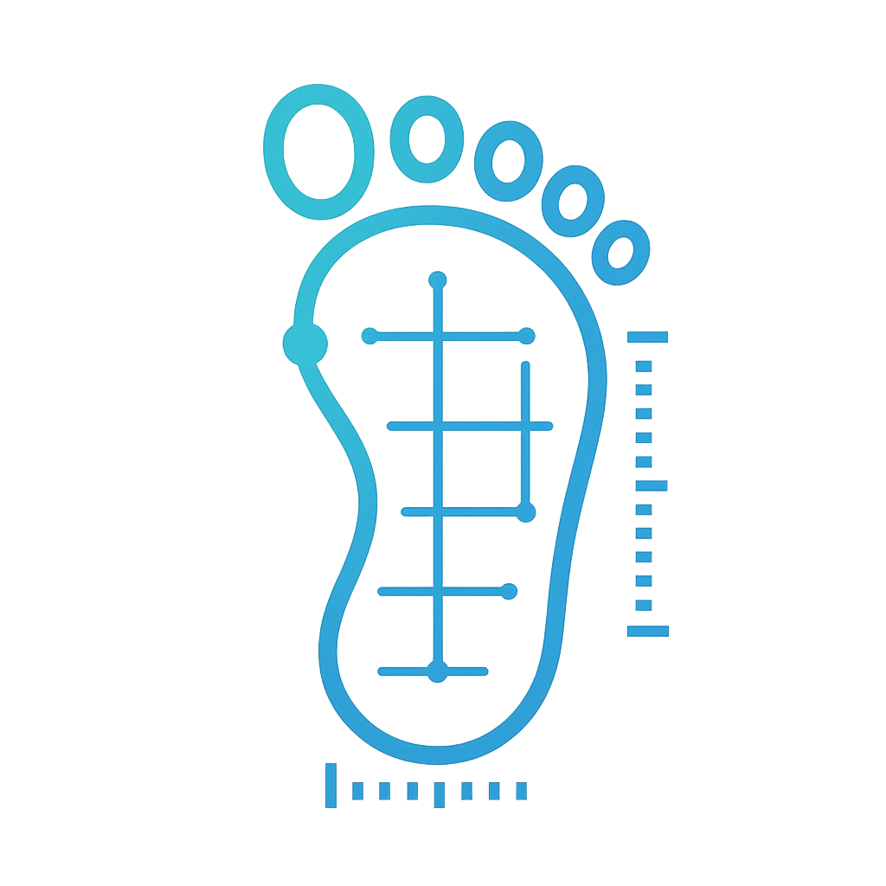
      <h3>MeuTamanho</h3>
      
👟 Medição com IA

      
Sistema de medição de pés (92.1% precisão)

      
<em>Computer Vision</em>

    </td>
    <td align="center" width="33%">
      
      <h3>KVM Personal Trainer</h3>
      
💪 Sistema Completo

      
Gerenciamento para personal trainers

      
<em>Fitness Profissional</em>

    </td>
  </tr>
</table>

---

## 🌐 Ferramentas Web & Extensões

<table>
  <tr>
    <td align="center" width="25%">
      
      <h3>RealVerse</h3>
      
💱 Conversor de Moedas

      
<em>Extensão Chrome</em>

    </td>
    <td align="center" width="25%">
      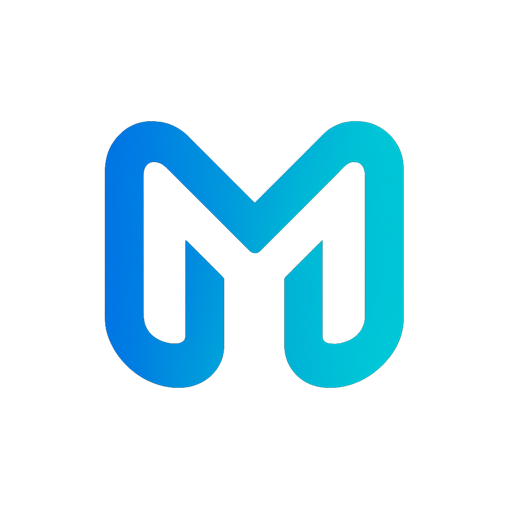
      <h3>MagniSearch</h3>
      
🔍 Busca Avançada

      
<em>Projeto Opensource</em>

    </td>
    <td align="center" width="25%">
      
      <h3>DevHubs</h3>
      
👨‍💻 Quest-board Devs

      
<em>Desenvolvimento</em>

    </td>
    <td align="center" width="25%">
      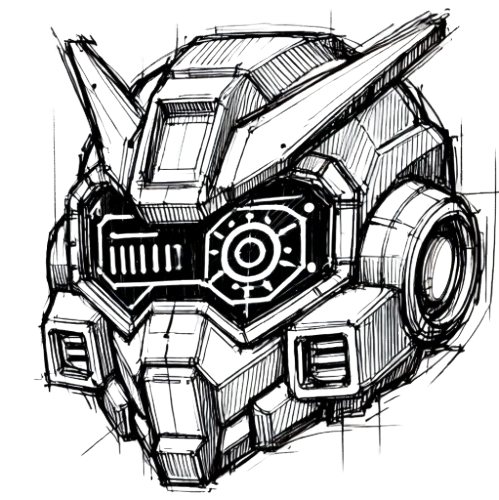
      <h3>Facebook Frauds</h3>
      
🚨 Detector de Fraudes

      
<em>Segurança</em>

    </td>
  </tr>
</table>

---

## 🔧 Ferramentas de Análise & Gestão

<table>
  <tr>
    <td align="center" width="25%">
      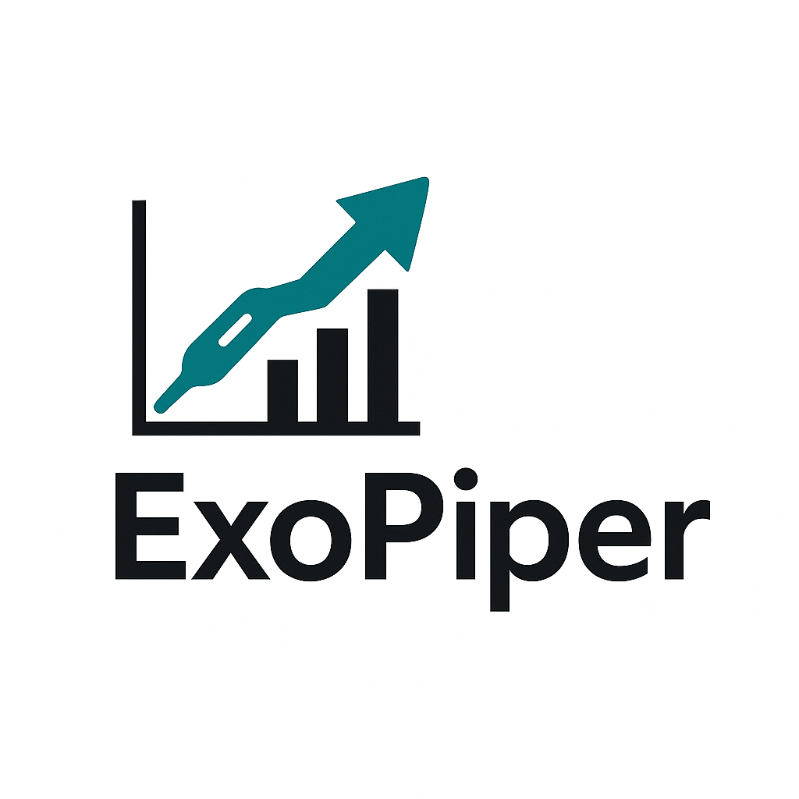
      <h3>Exo Piper SaaS</h3>
      
⚡ Auditoria Performance

      
<em>100% Completo</em>

    </td>
    <td align="center" width="25%">
      
      <h3>Exo Piper CLI</h3>
      
📊 Ferramenta CLI

      
<em>Análise Complexidade</em>

    </td>
    <td align="center" width="25%">
      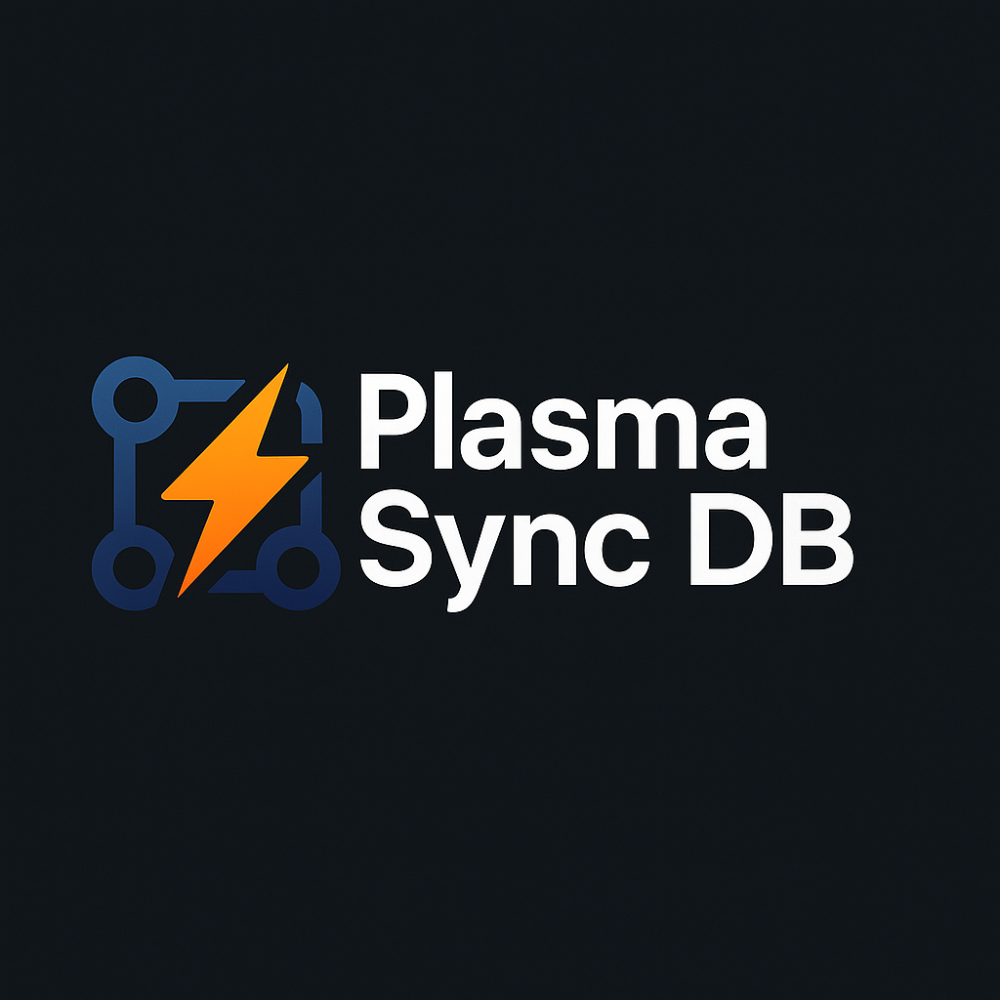
      <h3>PlasmaSync DB</h3>
      
🗄️ Banco Imutável

      
<em>Replicação P2P</em>

    </td>
    <td align="center" width="25%">
      
      <h3>GitHub ATS</h3>
      
📄 Gerador CV

      
<em>Recrutamento</em>

    </td>
  </tr>
</table>

---

## 🏪 Varejo & Gestão Empresarial

<table>
  <tr>
    <td align="center" width="33%">
      
      <h3>AdibPDV</h3>
      
🏪 Sistema PDV

      
Offline-first com integração fiscal

      
<em>Desenvolvimento</em>

    </td>
    <td align="center" width="33%">
      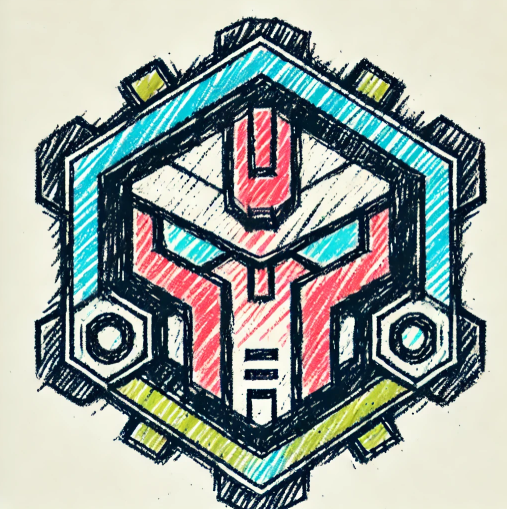
      <h3>AeroRoute Pro</h3>
      
✈️ Gestão Aérea

      
Plataforma B2B para operações aéreas

      
<em>Aviação & Logística</em>

    </td>
    <td align="center" width="33%">
      
      <h3>Asimov Leads</h3>
      
🎯 Google Maps

      
Software para captura de leads

      
<em>Lead Generation</em>

    </td>
  </tr>
</table>

---

## 🎨 Mídia & Conteúdo

<table>
  <tr>
    <td align="center" width="33%">
      
      <h3>DublagemBR</h3>
      
🎬 Dublagem Automática

      
Sistema para vídeos YouTube

      
<em>Processamento de Vídeo</em>

    </td>
    <td align="center" width="33%">
      
      <h3>Sass Rorschach</h3>
      
🧠 Teste Psicológico

      
Implementação digital

      
<em>MVP</em>

    </td>
    <td align="center" width="33%">
      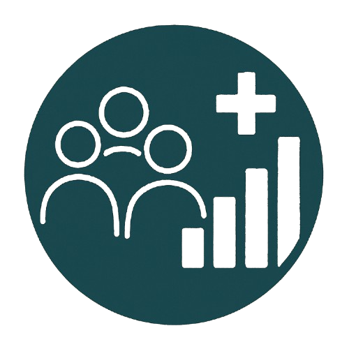
      <h3>ICS</h3>
      
📊 Índice Social

      
Sistema de contribuição social

      
<em>Análise Social</em>

    </td>
  </tr>
</table>

---

##  Stack Tecnológico

### Linguagens & Frameworks

### Frontend & Mobile

### Backend & APIs

### Blockchain & Crypto

### IA & Machine Learning

### Bancos de Dados

### Cloud & DevOps

---

##  Estatísticas GitHub

  
  

  

---

## 📊 Métricas dos Projetos

<table>
  <tr>
    <th>Categoria</th>
    <th>Quantidade</th>
    <th>Status</th>
  </tr>
  <tr>
    <td>🚀 Total de Projetos</td>
    <td><strong>70+</strong></td>
    <td>Ativo</td>
  </tr>
  <tr>
    <td>📈 Em Produção</td>
    <td><strong>15+</strong></td>
    <td>Live</td>
  </tr>
  <tr>
    <td>🛠️ Em Desenvolvimento</td>
    <td><strong>20+</strong></td>
    <td>Ativo</td>
  </tr>
  <tr>
    <td>🌟 Projetos Opensource</td>
    <td><strong>10+</strong></td>
    <td>Público</td>
  </tr>
  <tr>
    <td>🏢 Startups Parceiras</td>
    <td><strong>4</strong></td>
    <td>Ativa</td>
  </tr>
  <tr>
    <td>🎯 Categorias Principais</td>
    <td><strong>15</strong></td>
    <td>Diversificado</td>
  </tr>
</table>

---

## 🎓 Formação & Certificações

### 🎓 Formação Acadêmica

**Bacharelado em Sistemas de Informação**  
*Universidade Estácio de Sá (UNESA)*  
2020 - 2024

**Licenciatura em Física**  
*Universidade Federal do Rio de Janeiro (UFRJ)*  
2021 - 2026

### 🏆 Certificações em Andamento

- 🔸 AWS Certified Machine Learning - Specialty
- 🔸 Google Cloud Professional Data Engineer
- 🔸 Microsoft Azure Data Scientist Associate
- 🔸 Kubernetes Certified Administrator

---

##  Contribuições & Comunidade

- **🏢 CEO & CTO da AsimovTech Systems**
  - Liderança de equipe técnica e estratégias de inovação

- **💰 Fundador da AsimovTech Ventures**
  - Investimentos em startups de tecnologia emergente

- **⛓️ Voluntário na Ethereum Brasil**
  - Organização de workshops e eventos blockchain

- **✍️ Escritor Técnico**
  - Produção de conteúdo sobre tecnologias emergentes

- **🤝 Mentor de Desenvolvedores**
  - Orientação em projetos opensource e carreira tech

---

##  Áreas de Especialização

  

---

### 🚀 Vamos Construir o Futuro Juntos!

*Sempre aberto a colaborações, partnerships e projetos inovadores*

**Transformando ideias em realidade, um código por vez** 💻✨

