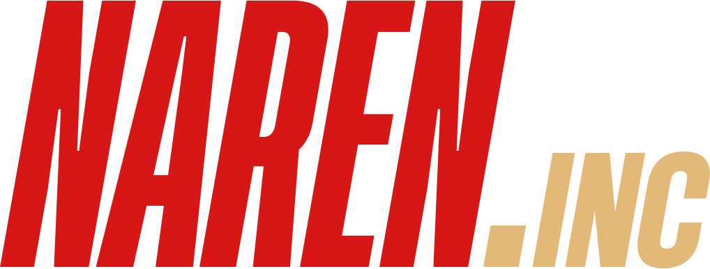
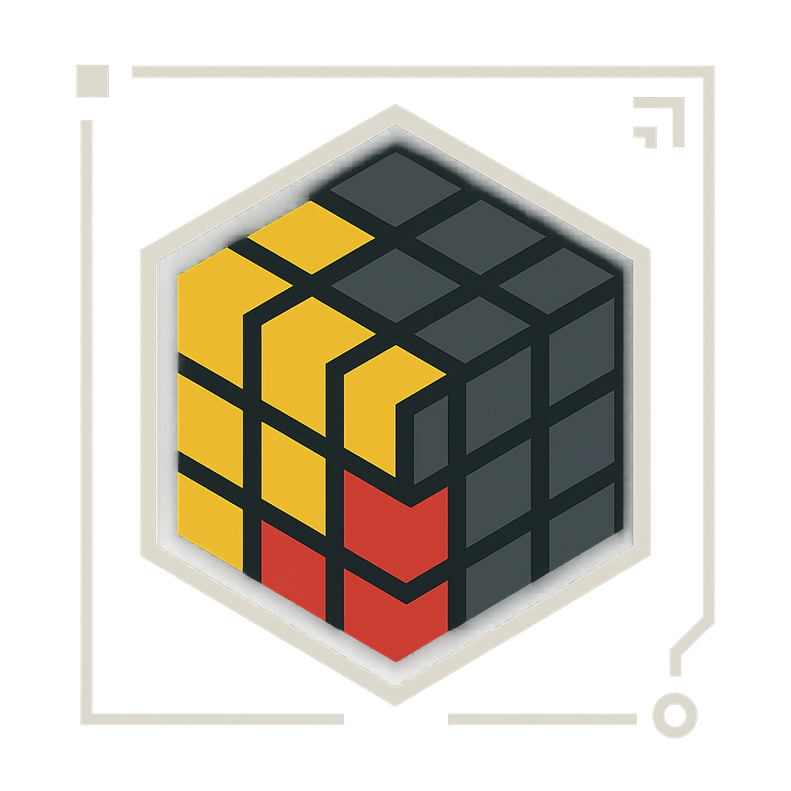
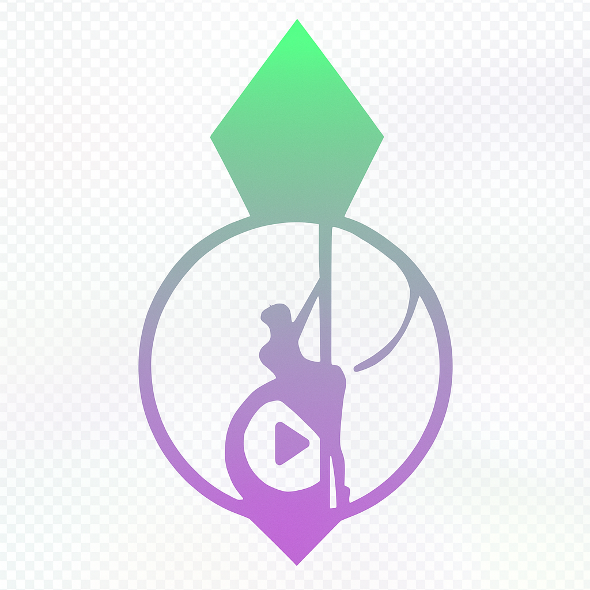

# DougDotCon

### 🚀 Full Stack Developer

*Transforming ideas into innovative technological solutions*

---

## 🎯 About Me

I am an entrepreneur and developer passionate about technology, with a background in **Information Systems** and **Physics**.

- 🔬 **70+ projects** developed in various technological areas
- 🏢 **15+ projects** in active production
- 🌱 **20+ projects** in continuous development
- 🎯 **Specialties:** AI, Blockchain, Algorithmic Trading, SaaS, DevOps

---

## 🏢 Main Company

<table>
  <tr>
    <td align="center" width="50%">
      
      <h3>asimovtech systems</h3>
      
<a href="https://asimovtech.systems/">🌐 asimovtech.systems</a>

      
Technology company specializing in innovative solutions

    </td>
    <td align="center" width="50%">
      
      <h3>AsimovTech Ventures</h3>
      
<a href="https://asimovtech-ventures.vercel.app/">🌐 Investment Fund</a>

      
Investments focused on technology startups

    </td>
  </tr>
</table>

---

## 🤝 Partner Startups

<table>
  <tr>
    <td align="center" width="20%">
      
      <h4>NarenInc</h4>
      
Technology Consulting (Commercial)

    </td>
    <td align="center" width="20%">
      
      <h4>Muttercorp</h4>
      
Technology Consulting (Programming)

    </td>
    <td align="center" width="20%">
      
      <h4>KVM Personal Trainer</h4>
      
Fitness Systems

    </td>
    <td align="center" width="20%">
      
      <h4>ReisBit</h4>
      
Video Editing

    </td>
    <td align="center" width="20%">
      
      <h4>PlumbEdit</h4>
      
Video Editing & Post-Production

    </td>
  </tr>
</table>

---

## 🛠️ Technology Stack

*To be defined based on project analysis...*

---

## 📈 GitHub Stats

  

