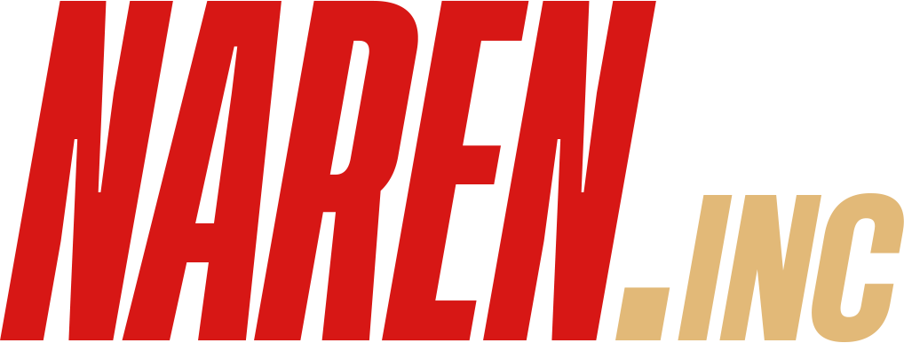
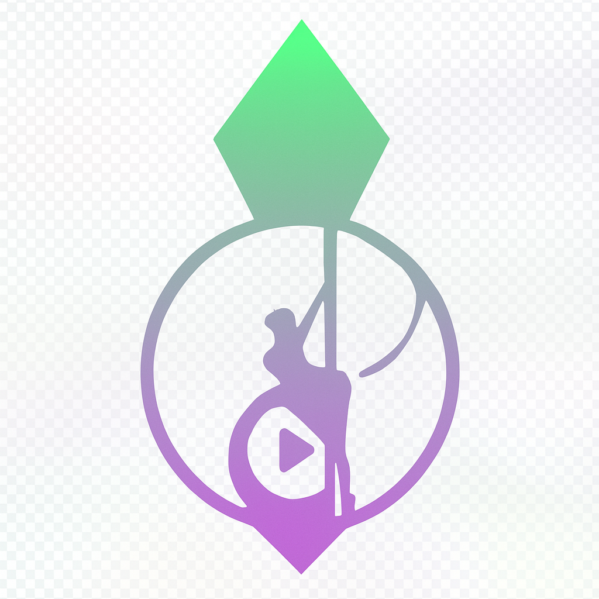

# DougDotCon

### 🚀 Desenvolvedor Full Stack

*Transformando ideias em soluções tecnológicas inovadoras*

---

## 🎯 Sobre Mim

Sou um empreendedor e desenvolvedor apaixonado por tecnologia, com formação em **Sistemas de Informação** e **Física**.

- 🔬 **70+ projetos** desenvolvidos em diversas áreas tecnológicas
- 🏢 **15+ projetos** em produção ativa
- 🌱 **20+ projetos** em desenvolvimento contínuo
- 🎯 **Especialidades:** IA, Blockchain, Trading Algorítmico, SaaS, DevOps

---

## 🏢 Empresa Principal

<table>
  <tr>
    <td align="center" width="50%">
      
      <h3>asimovtech systems</h3>
      
<a href="https://asimovtech.systems/">🌠asimovtech.systems</a>

      
Empresa de tecnologia especializada em soluções inovadoras

    </td>
    <td align="center" width="50%">
      
      <h3>AsimovTech Ventures</h3>
      
<a href="https://asimovtech-ventures.vercel.app/">🌠Fundo de Investimento</a>

      
Investimentos focados em startups de tecnologia

    </td>
  </tr>
</table>

---

## 🤝 Startups Parceiras

<table>
  <tr>
    <td align="center" width="20%">
      
      <h4>NarenInc</h4>
      
Consultoria Tecnológica (Comercial)

    </td>
    <td align="center" width="20%">
      
      <h4>Muttercorp</h4>
      
Consultoria Tecnológica (Programação)

    </td>
    <td align="center" width="20%">
      
      <h4>KVM Personal Trainer</h4>
      
Sistemas de Fitness

    </td>
    <td align="center" width="20%">
      
      <h4>ReisBit</h4>
      
Edição de Vídeos

    </td>
    <td align="center" width="20%">
      
      <h4>PlumbEdit</h4>
      
Edição e Pós-Produção de Vídeos

    </td>
  </tr>
</table>

---

## 🛠️ Stack de Tecnologia

*A definir com base na análise dos projetos...*

---

## 📈 Estatísticas do GitHub

  

